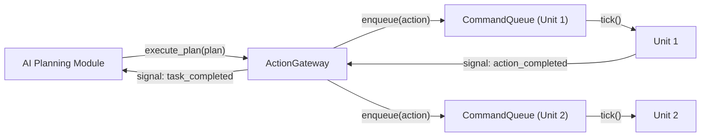
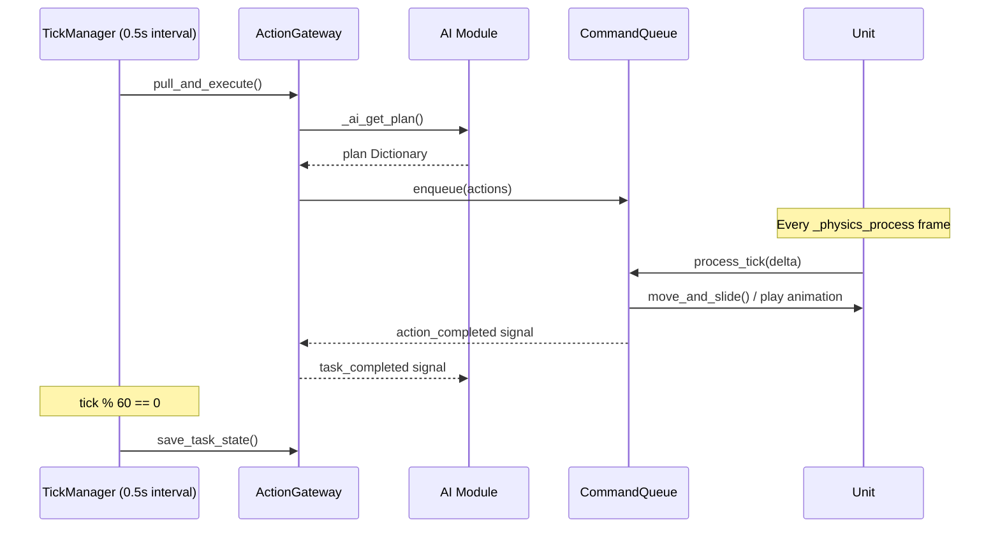

# Core-to-AI API and Interface Orchestration -- Technical Report

## 1. Introduction

This document specifies the architectural refactoring of the Core System to expose a high-level API for the AI Planning Team. The design follows an **interface-driven, signal-coupled, tick-synchronised** model that allows the AI module to issue abstract commands such as `go_chop_tree(unit_id, tree_id)` without managing pathfinding, animation state machines, or resource node bookkeeping.

> [!IMPORTANT]
> All interactions between the AI module and the Core system are mediated through a single **ActionGateway** singleton. The AI team never instantiates Godot nodes or calls engine functions directly.

---

## 2. Interface-Driven Architecture

### 2.1 The IUnitAction Contract

Since GDScript lacks formal interfaces, the `IUnitAction` class (extending `RefCounted`) defines a **contract** enforced at runtime via duck-typing validation.

```gdscript
## IUnitAction.gd -- Interface contract
extends RefCounted
class_name IUnitAction

enum ActionState {
    PENDING,
    RUNNING,
    COMPLETED,
    FAILED
}

func start(_unit: CharacterBody2D, _target: Node2D) -> void:
    push_error("IUnitAction.start() is abstract.")

func tick(_unit: CharacterBody2D, _delta: float) -> int:
    push_error("IUnitAction.tick() is abstract.")
    return ActionState.FAILED

func cancel(_unit: CharacterBody2D) -> void:
    push_error("IUnitAction.cancel() is abstract.")

func serialize() -> Dictionary:
    push_error("IUnitAction.serialize() is abstract.")
    return {}

static func is_implemented_by(obj: Variant) -> bool:
    if obj == null:
        return false
    return (
        obj.has_method("start")
        and obj.has_method("tick")
        and obj.has_method("cancel")
        and obj.has_method("serialize")
    )
```

### 2.2 Decoupling via the ActionGateway

The AI Planning Team interacts **exclusively** with the `ActionGateway` autoload singleton. They submit a "Big Plan" (a `Dictionary` containing unit IDs and target action strings), and the Gateway translates it into `IUnitAction` objects enqueued into per-unit `CommandQueue` instances.



---

## 3. High-Level Function Abstraction (The Task Layer)

### 3.1 Behavioural Wrappers

Each wrapper performs **pre-flight** logic: it creates one or more `IUnitAction` objects and enqueues them sequentially.

| Gateway Method | Description | Actions Enqueued |
|---|---|---|
| `go_chop_tree(unit_id, tree_id)` | Pathfind to a tree, then harvest it | `UnitActionMove` + `UnitActionHarvest` |
| `go_mine_stone(unit_id, stone_id)` | Pathfind to a stone, then harvest it | `UnitActionMove` + `UnitActionHarvest` |
| `go_construct(unit_id, scene, pos, dur)` | Pathfind to position, then build | `UnitActionMove` + `UnitActionConstruct` |
| `move_unit(unit_id, destination)` | Simple move-to-position | `UnitActionMove` |

### 3.2 Plan Execution (Push/Pull)

The `execute_plan(plan: Dictionary)` method parses a JSON-style plan and dispatches commands:

```json
{
  "plan_id": "harvest-alpha-001",
  "commands": [
    {"unit_id": 1, "action": "MOVE",      "target": {"x": 100, "y": 200}},
    {"unit_id": 1, "action": "HARVEST",    "target_id": 42},
    {"unit_id": 2, "action": "CONSTRUCT",  "scene": "res://Houses/Barracks.tscn",
     "position": {"x": 300, "y": 150}, "duration": 15}
  ]
}
```

The **Pull** variant is driven by `TickManager`: each simulation tick calls `ActionGateway.pull_and_execute()`, which invokes the AI module's `get_plan()` function and feeds the result into `execute_plan()`.

### 3.3 State Reporting (Sense API)

The `SenseAPI` class provides read-only queries:

| Method | Returns |
|---|---|
| `get_all_units()` | `Array[Dictionary]` -- id, position, health, is\_idle, pending\_actions |
| `get_unit(unit_id)` | `Dictionary` -- single unit snapshot |
| `get_units_near(origin, radius)` | `Array[Dictionary]` -- units within radius |
| `get_all_resources()` | `Array[Dictionary]` -- all MapResource nodes |
| `get_resources_near(origin, radius)` | `Array[Dictionary]` -- filtered by distance |
| `get_all_buildings()` | `Array[Dictionary]` -- all building nodes |
| `get_buildings_near(origin, radius)` | `Array[Dictionary]` -- filtered by distance |
| `get_resources_stockpile()` | `Dictionary` -- `{wood: int, stone: int}` |
| `get_tick_count()` | `int` -- current simulation tick |

All return types are plain `Dictionary` / `Array` for straightforward JSON serialisation.

---

## 4. Godot Technical Implementation

### 4.1 Signal-Based Communication

The following signals propagate from the `CommandQueue` through the `ActionGateway` to the AI layer:

| Signal | Emitter | Payload | Purpose |
|---|---|---|---|
| `action_completed` | `CommandQueue` | `unit_id, action_data` | An action finished successfully |
| `action_failed` | `CommandQueue` | `unit_id, action_data` | An action could not complete |
| `queue_empty` | `CommandQueue` | `unit_id` | Unit has no more queued work |
| `task_completed` | `ActionGateway` | `unit_id, action_data` | Relayed to AI listeners |
| `task_failed` | `ActionGateway` | `unit_id, action_data` | Relayed to AI listeners |
| `path_blocked` | `ActionGateway` | `unit_id, position` | Collision notification |
| `plan_execution_finished` | `ActionGateway` | `plan_id` | All commands from a plan dispatched |

**AI team usage:**

```gdscript
func _ready():
    ActionGateway.task_completed.connect(_on_task_done)
    ActionGateway.task_failed.connect(_on_task_failed)

func _on_task_done(unit_id: int, data: Dictionary):
    print("Unit ", unit_id, " finished: ", data)
```

### 4.2 Tick-Based Synchronisation



- **Plan polling** occurs on tick boundaries (2 Hz by default).
- **Action execution** (movement, animation) happens every `_physics_process` frame for smooth interpolation.
- **Auto-save** triggers every 60 ticks (30 seconds at 2 tps).

### 4.3 Persistence

`TaskSerializer` writes the following JSON to `user://ai_task_state.json`:

```json
{
  "timestamp": 1742123456,
  "resources": {"wood": 5, "stone": 3},
  "units": [
    {
      "id": 1,
      "position": {"x": 100.5, "y": 200.3},
      "queue": [
        {"type": "MOVE", "target_position": {"x": 193, "y": 132}, "state": 1},
        {"type": "HARVEST", "target_id": 42, "elapsed": 2.5, "state": 1}
      ]
    }
  ]
}
```

Restoration is invoked via `ActionGateway.restore_task_state()` during scene loading.

---

## 5. API Command Reference

| Command String | Gateway Method | Parameters | Expected Result |
|---|---|---|---|
| `MOVE` | `move_unit()` | `unit_id: int`, `destination: Vector2` | Unit pathfinds to destination; `task_completed` on arrival |
| `HARVEST` | `go_chop_tree()` / `go_mine_stone()` | `unit_id: int`, `target_id: int` | Unit moves to resource, harvests until depleted; resource counter updated |
| `CONSTRUCT` | `go_construct()` | `unit_id: int`, `scene: String`, `pos: Vector2`, `duration: float` | Unit moves to build site, plays build animation, instantiates building scene |
| Full Plan | `execute_plan()` | `plan: Dictionary` (see Section 3.2) | Dispatches all commands; emits `plan_execution_finished` |
| State Query | `sense().get_*()` | Varies per method (see Section 3.3) | Returns `Dictionary` / `Array` snapshots |

---

## 6. File Structure

```
Core-systems/
  Logic/
    ActionGateway.gd        # Autoload -- AI entry-point
    CommandQueue.gd          # Per-unit sequential command queue
    Game.gd                  # Global game state (existing)
    SenseAPI.gd              # Read-only query interface
    TaskSerializer.gd        # JSON persistence
    TickManager.gd           # Simulation tick (refactored)
    Interfaces/
      IUnitAction.gd         # Abstract action interface
    Actions/
      UnitActionMove.gd      # MOVE implementation
      UnitActionHarvest.gd   # HARVEST implementation
      UnitActionConstruct.gd # CONSTRUCT implementation
  Entities/
    Units/
      Unit.gd                # Refactored -- owns CommandQueue
```

---

## 7. Validation: Command Queue Tick-Jitter Analysis

### 7.1 Bounded Work Per Tick

The `CommandQueue` has a hard capacity of `MAX_QUEUE_SIZE = 32` actions per unit. With the non-functional requirement of 1--20 units, worst-case per-tick work is:

$$W_{tick} = N_{units} \times 1 = 20 \text{ action ticks}$$

Each `action.tick()` call performs at most one `move_and_slide()` and one animation state check -- both $O(1)$ operations. Total per-tick overhead is therefore $O(N_{units})$ with $N_{units} \leq 20$, well within the frame budget.

### 7.2 Tick Interval vs. Physics Frame

| Parameter | Value |
|---|---|
| Tick interval | 0.5 s (2 Hz) |
| Physics frame rate | 60 Hz (default) |
| Actions executed per physics frame | 1 per unit (current action only) |
| Plan polling | Once per tick (not per frame) |

Plan polling is decoupled from action execution: the `TickManager` polls plans at 2 Hz, while `Unit._physics_process` drives smooth movement at 60 Hz. This eliminates jitter caused by irregular plan arrival times.

### 7.3 Non-Functional Requirements Compliance

| Requirement | Status |
|---|---|
| Native desktop application | Godot 4.6 native build -- no web dependencies |
| Server-side Source of Truth | All actions processed through authoritative `TickManager` |
| 1--20 unit limit | `CommandQueue` bounded; $O(N)$ with $N \leq 20$ |
| Persistence | `TaskSerializer` saves to `user://` as JSON |
| No tick-jitter | Action execution decoupled from plan polling |

---

## 8. Conclusion

The refactored architecture provides a clean separation of concerns:

1. **AI Team** scripts strategy via `ActionGateway.execute_plan()` or high-level wrappers.
2. **Core System** translates plans into `IUnitAction` objects, queued per-unit in `CommandQueue` instances.
3. **TickManager** drives the authoritative simulation loop, polling plans and triggering auto-saves.
4. **Signals** provide asynchronous feedback so the AI layer knows when tasks complete or fail.

This creates the seamless "Prepare and Execute" cycle requested: the AI team scripts the strategy, and the Core system handles the Godot-heavy execution.
